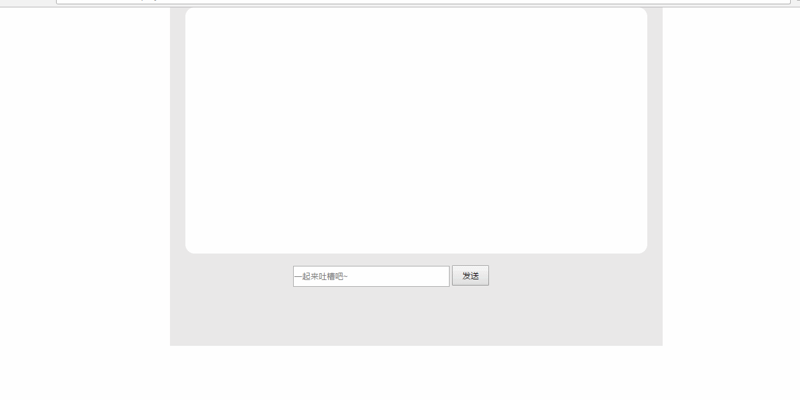

## 直播视频弹幕实现原理

技能实现
* [html](http://www.w3school.com.cn/html/index.asp)
* [css](http://www.w3school.com.cn/css/index.asp)
* [js](https://www.w3cschool.cn/javascript/)
### HTML如下
```
<!DOCTYPE html>
<html lang="en">
<head>
    <meta charset="UTF-8">
    <title>Barrage</title>
    <link rel="stylesheet" href="css/Barrage.css">
</head>
<body>
<div id="wrap">
    <div id="content"></div>
    <input type="text" id="txt" placeholder="一起来吐槽吧~" onkeydown="send(event)"/>
    <input type="button" value="发送" id="btn"/>
</div>
</body>
</html>
<script src="js/jquery.min.js"></script>
<script src="js/Barrage.js"></script>
```
### CSS实现如下
```
*{
    margin:0;
    padding:0;
}
#wrap{
    width:800px;
    height:550px;
    background:#E9E8E8;
    margin:0 auto;
    position:relative;
}
#content{
    width:750px;
    height:400px;
    background:#fff;
    margin:0 auto;
    border-radius: 15px;
    position:relative;
    overflow:hidden;
}
input:nth-of-type(1){
    width:250px;
    height:30px;
    margin:20px 0 0 200px;
}
input:nth-of-type(2){
    width:60px;
    height:33px;
}
.p{
    height:30px;
    line-height:30px;
    position:absolute;
    top:0;
    left:770px;
    font-weight:900;
    font-size: 30px;
}
```
### js实现如下
```javascript
;$(function(){
    $("#btn").click(function(){
        var $value=$("#txt").val();//获取输入框的值
        var $p=$("<p></p>");//创建一个p标签
        $p.addClass("p");//为p标签创建一个class为p
        $p.text($value);//把输入框的值赋值给p标签
        $("#txt").val("");//点击过后设置文本框内容为空
        var _top=Math.floor(Math.random()*($("#content").innerHeight()-30));//随机高度：$("#content")的高度减去p标签的高度
        var _fontsize=16+Math.floor(Math.random()*10);//随机字体大小16-26
        var _rgb="rgb(" + Math.floor(Math.random()*255)+"," + Math.floor(Math.random()*255)+"," + Math.floor(Math.random()*255)+")";
        //随机颜色
        $p.css({"top":_top,"font-size":_fontsize,"color":_rgb});//设置p标签的css值
        $("#content").append($p);//把p标签插入到#content容器里
        var _timer=Math.ceil(Math.random()*4000)+3000;//随机时间3-7秒时间
        $p.stop().animate({"left":"-500px"},_timer,function(){
            $(this).remove();
        });//从左至右的动画，最后给删除元素。
    });
    window.send=function(event){
        if (event.keyCode == 13 || event.which == 13) {
            $("#btn").click();
        }
    };
});
```
